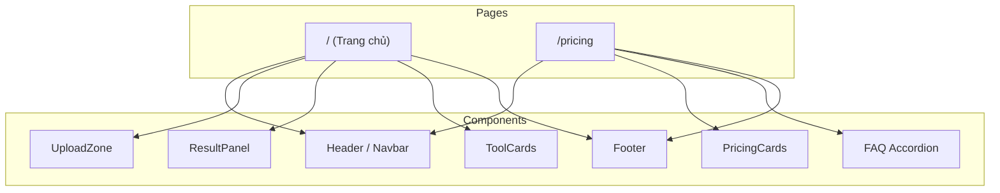

# Kế hoạch triển khai UI — Trang chủ & Pricing

## Mục tiêu

Xây dựng giao diện web cho ứng dụng **OCR Universe** gồm 2 trang: **Trang chủ** (công cụ OCR chính) và **Pricing** (bảng giá). Thiết kế dark-first, SaaS hiện đại, lấy cảm hứng về tính năng từ imagetotext.io nhưng phong cách riêng biệt.

> [!NOTE]
> Tham khảo thiết kế gốc: https://www.imagetotext.io/ và https://www.imagetotext.io/pricing-plan

## Công nghệ sử dụng

| Công nghệ | Phiên bản | Vai trò |
|---|---|---|
| **Next.js** (App Router) | latest | Framework |
| **TypeScript** | 5.x | Ngôn ngữ |
| **Tailwind CSS** | 4.x | Styling |
| **ESLint** | latest | Linting |
| **Tesseract.js** | (client-side) | OCR engine tạm thời, sau chuyển sang API backend |

---

## Kiến trúc tổng quan



---

## Trang chủ (`/`)

### Layout

| Vùng | Nội dung | Trạng thái |
|---|---|---|
| **Header** | Logo (`logo.png`), "OCR Universe", menu (Trang chủ, Bảng giá), Đăng nhập, CTA | ✅ Done |
| **Hero** | Split layout: text trái + upload phải. Tiêu đề "OCR Universe" gradient emerald→indigo, badge quảng cáo, stats row (50K+, 99%, 2s, 10+) | ✅ Done |
| **Upload Zone** | Khu vực kéo-thả + chọn file, format badges (JPG, PNG, WEBP, BMP, TIFF), glow effect khi hover | ✅ Done |
| **Result Panel** | Hiển thị kết quả OCR, nút Sao chép / Tải về (.txt), stat badges | ✅ Done |
| **Cách hoạt động** | 3 bước: Tải ảnh lên → AI xử lý → Nhận kết quả. Glow-card effect | ✅ Done |
| **Other Tools** | Grid 4 thẻ: Image Translator, JPG to Word, Text to PDF, PDF to Word | ✅ Done |
| **Footer** | 4-column layout, emerald hovers, dynamic year | ✅ Done |

### Tính năng tương tác

- Drag & drop ảnh hoặc click chọn file
- Preview ảnh đã upload
- Loading spinner + progress bar khi OCR đang xử lý
- Nút **Sao chép** (copy to clipboard) + **Tải về** (download .txt)
- Hiển thị confidence score và thời gian xử lý
- Responsive (mobile-first)

---

## Trang Pricing (`/pricing`)

### Layout

| Vùng | Nội dung |
|---|---|
| **Header** | Dùng chung với Trang chủ |
| **Title** | "Bảng giá minh bạch" (gradient emerald) |
| **Toggle** | Chuyển đổi Monthly ↔ Yearly |
| **Pricing Cards** | 3 cột: Basic (Free), Standard, Premium |
| **FAQ** | Accordion các câu hỏi thường gặp |
| **Footer** | Dùng chung |

### Cấu trúc gói cước (đề xuất)

| | Basic (Free) | Standard | Premium |
|---|---|---|---|
| Giá/tháng | $0 | $9.99 | $19.99 |
| Lượt OCR/ngày | 5 | 100 | Không giới hạn |
| Kích thước file | 2MB | 10MB | 50MB |
| AI Processing | ❌ | ✅ | ✅ |
| Quảng cáo | Có | Không | Không |
| Hỗ trợ | Community | Email | Ưu tiên |

---

## Thiết kế hệ thống (Design Tokens) — Dark-first

| Token | Giá trị |
|---|---|
| Background Primary | `#0a0e1a` |
| Background Card | `#1a2235` |
| Text Primary | `#ffffff` |
| Text Secondary | `#e2e8f0` |
| Text Muted | `#b0bec5` |
| Accent | `#10b981` (Emerald) |
| Accent 2 | `#6366f1` (Indigo) |
| Border | `rgba(255,255,255,0.12)` |
| Font | Inter (Google Fonts, Vietnamese subset) |

---

## Cấu trúc file thực tế

```
frontend/
├── app/
│   ├── layout.tsx          ← Root layout (Header + Footer)
│   ├── page.tsx            ← Trang chủ
│   ├── pricing/
│   │   └── page.tsx        ← Pricing
│   └── globals.css         ← Tailwind + base styles
├── components/
│   ├── Header.tsx
│   ├── Footer.tsx
│   ├── UploadZone.tsx      ← Drag & drop + file picker
│   ├── ResultPanel.tsx     ← Kết quả OCR + actions
│   ├── ToolCard.tsx        ← Card công cụ bổ sung
│   ├── PricingCard.tsx     ← Card gói cước
│   └── FAQ.tsx             ← Accordion FAQ
├── hooks/                  ← Custom React hooks
├── services/
│   └── api.ts              ← API layer (OCR + Pricing)
└── public/
    └── icons/              ← SVG icons
```

---

## Các bước triển khai

| # | Bước | Mô tả |
|---|---|---|
| 1 | ~~Khởi tạo Next.js~~ | ✅ Đã tạo trong `frontend/` (TS + Tailwind + App Router) |
| 2 | ~~Cấu trúc thư mục~~ | ✅ `components/`, `hooks/`, `services/api.ts` |
| 3 | ~~Design system~~ | ✅ Dark-first tokens, animations (fadeIn, pulse-glow), grid-bg, glow-card effects |
| 4 | ~~Shared components~~ | ✅ `Header` (glassmorphism, active route), `Footer` (4-column dark) |
| 5 | ~~Trang chủ~~ | ✅ Split hero, stats row, "Cách hoạt động" 3 bước, "Công cụ khác" grid |
| 6 | Tích hợp OCR | Kết nối `UploadZone` với Tesseract.js (client-side) |
| 7 | ~~Trang Pricing~~ | ✅ 3-column cards, toggle monthly/yearly, FAQ accordion |
| 8 | Responsive & Polish | Mobile layout, animations, micro-interactions |
| 9 | Kiểm tra | Test thủ công trên desktop + mobile viewport |

---

## Xác minh

```bash
cd frontend && npm run dev
```

- Mở `http://localhost:3000` → kiểm tra Trang chủ
- Mở `http://localhost:3000/pricing` → kiểm tra Pricing
- Upload ảnh mẫu → xác nhận OCR hoạt động và hiển thị kết quả
